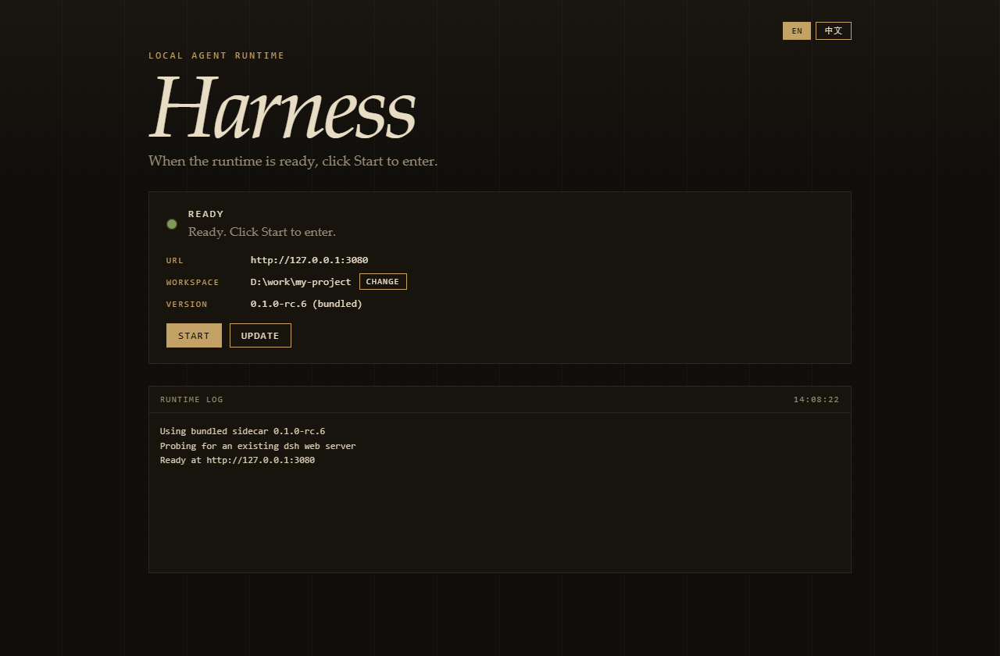

# DeepSeek Harness Desktop

**English** · [中文](README.zh.md)

**No Node setup. No CLI. Official DeepSeek Harness in a Windows window.**

Click **Start** to open the official web UI. Closing the window does not kill the agent. When upstream publishes a new `dsh`, click **Update** — you do not need to rebuild the Electron app.

[Official DeepSeek Harness](https://github.com/deepseek-ai/deepseek-harness) · Windows x64 · MIT

<p align="center">
  
</p>

<p align="center"><sub>The app stays on the home screen until you click Start. Switch the shell to 中文 from the top-right. The official Harness UI keeps its own language.</sub></p>

---

## What this is

DeepSeek Harness (`dsh`) is the official local agent runtime: plugins, workspace, and web UI all live there. It wants a recent Node and a command line.

**This project is not a fork and does not reimplement the agent.**  
It is a thin Electron shell:

1. Ships portable Node 22 and launches official `@deepseek-ai/dsh web`
2. Waits until `127.0.0.1` is ready, then lets you click **Start**
3. Closing the window hides to the tray and **does not** stop the job
4. Quit from the tray sends `SIGTERM` and waits for the official graceful shutdown

The shell does not run the model, install plugins, or own your sessions. Those still live in official `~/.dsh`.

---

## Why use it

| Pain | What this shell does |
|---|---|
| Node missing or too old | Bundles Node 22.23.2; does not pollute the system install |
| You just want a double-click | Home screen, green lamp, **Start** |
| Upstream moves fast, rebuilds are heavy | **Update** installs the latest `dsh` into user data |
| Closing the window kills the agent | Close = tray; the sidecar keeps running |
| Each project needs a different cwd | **Change** workspace on the home screen |
| Fear of a private desktop fork | Not a fork. The agent is the official package |

<p align="center">
  
</p>

<p align="center"><sub>Update replaces the runtime only. The Electron chrome stays as-is.</sub></p>

---

## Features

- **Enter on purpose** — stay on the home screen until you click Start
- **English / 中文** — shell home, tray, and dialogs; default English. Official Harness UI is unchanged
- **Update program** — query npm (then npmmirror), install into `%APPDATA%\DeepSeek Harness\runtime`
- **Restore bundled** — tray item deletes the overlay
- **Workspace** — home **Change** or tray **Choose workspace…**, saved in `desktop.json`
- **Tray lifecycle** — close does not kill; quit waits ~5 seconds
- **Official data dir** — `~/.dsh`, overridable with `DSH_HOME`

---

## For users

### Portable copy

Copy the whole `release/win-unpacked/` folder to another **Windows 10/11 x64** machine and run `DeepSeek Harness.exe`.

Copy the entire folder, not just the exe. The build is unsigned; SmartScreen may ask you to run anyway.

### Installer

```powershell
pnpm install
pnpm prepare:runtime
pnpm build:win
```

Output: `release/DeepSeek-Harness-Setup-0.1.0-win-x64.exe`

macOS (build on a Mac):

```sh
pnpm install
pnpm prepare:runtime
pnpm build:mac
```

Output: `release/DeepSeek-Harness-0.1.0-mac-x64.dmg`

### GitHub Releases

Pushing a `v*` tag builds Windows x64 / macOS x64 / macOS arm64 installers on GitHub Actions and publishes them to a GitHub Release:

```powershell
git tag v0.1.0
git push origin v0.1.0
```

See `.github/workflows/release.yml`. Note: the app is not Apple-signed or notarized, so macOS users must allow it in System Settings → Privacy & Security (or right-click → Open) on first launch.

---

## For contributors

You need **Node ≥ 22.17** on the build machine (scripts only; the agent uses the bundled Node).

```powershell
pnpm install
pnpm prepare:runtime
pnpm test
pnpm dev
```

`prepare:runtime` writes `resources/runtime/` (gitignored).

### Do not commit these

| Path | Why |
|---|---|
| `node_modules/` | `pnpm install` |
| `resources/runtime/` | `pnpm prepare:runtime` |
| `resources/.cache/` | download cache |
| `release/` | `pnpm build:win` |
| `dist/` | `tsc` |

---

## How it fits together

```
Electron shell          window / tray / home (this repo, i18n here)
        │
        ▼
Portable Node + official dsh     bundled or userData overlay
        │
        ▼
Official web UI         language is upstream's, not this shell
```

---

## FAQ

**Is this the official DeepSeek desktop app?**  
No. Independent thin shell around published `@deepseek-ai/dsh`.

**Does Update change this window?**  
No. It only updates the official runtime. Shell changes need `pnpm build:win`.

**ARM or 32-bit Windows?**  
Not in the current Windows x64 build.

---

## License

[MIT](LICENSE)

DeepSeek and DeepSeek Harness are trademarks of their respective owners. This project is not affiliated with DeepSeek.
