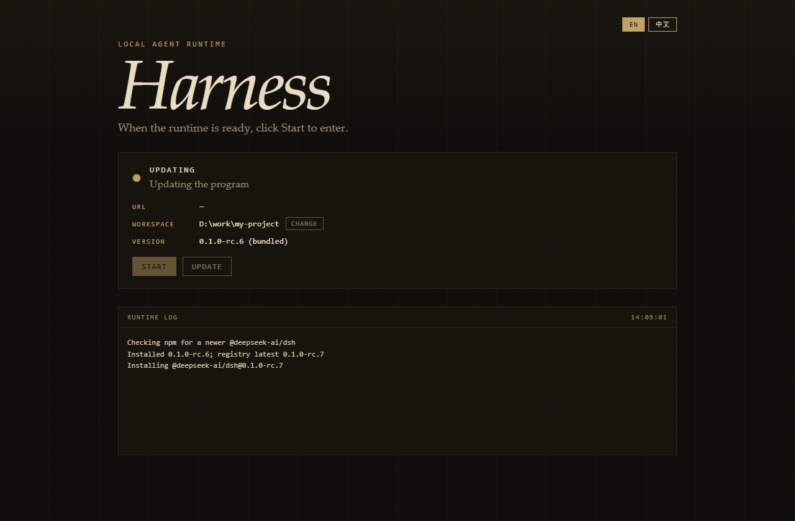

# DeepSeek Harness Desktop

[English](README.md) · **中文**

**不用配 Node、不用记命令。把官方 DeepSeek Harness 装进一个 Windows 窗口里。**

点 **启动** 进入官方 Web 界面。关窗口不杀任务。官方发新版时点 **更新程序** 即可，不必重打整个 Electron 包。

[官方 DeepSeek Harness](https://github.com/deepseek-ai/deepseek-harness) · Windows x64 · MIT

<p align="center">
  
</p>

<p align="center"><sub>就绪后停在首页，由你决定何时进入。右上角可切回 English。官方 Harness 页面的语言不受这里控制。</sub></p>

---

## 这是什么

DeepSeek Harness（`dsh`）是官方的本地 Agent 运行时：插件、工作区、Web UI 都在它里面。它要求本机 Node 足够新，还得会跑命令行。

**本项目不是 fork，也不重写 Agent。**  
它是一层很薄的 Electron 壳：

1. 自带便携 Node 22，拉起官方 `@deepseek-ai/dsh web`
2. 等 `127.0.0.1` 就绪后，让你点 **启动**
3. 关窗口只进托盘，**不打断**正在跑的任务
4. 从托盘退出时按官方约定优雅停掉运行时

壳进程不跑模型、不装插件、不碰你的会话数据。那些仍然走官方的 `~/.dsh`。

---

## 为什么值得用

| 痛点 | 这里怎么处理 |
|---|---|
| 本机 Node 太旧或没装 | 安装包自带 Node 22.23.2，不污染系统环境 |
| 只想双击，不想记 `dsh web` | 首页绿灯亮了点 **启动** |
| 官方仓库天天更新，重打包太重 | **更新程序** 从 npm 拉最新 `dsh` 到用户目录 |
| 关窗口就丢了正在跑的 Agent | 关窗口 = 最小化到托盘 |
| 换项目还要改命令行 cwd | 首页 **更改** 工作区 |
| 怕桌面壳把官方运行时改坏 | 不 fork。Agent 仍是官方包 |

<p align="center">
  
</p>

<p align="center"><sub>更新只换运行时，Electron 窗口本身不用重编。</sub></p>

---

## 功能一览

- **就绪再进**：运行时起来之后停在首页，点启动才打开 UI
- **English / 中文**：只切壳的首页、托盘和对话框，默认英文；官方 Harness 界面语言不管
- **更新程序**：查 npm（失败会试 npmmirror），有新版本就装到 `%APPDATA%\DeepSeek Harness\runtime`
- **恢复内置版本**：托盘里一键删掉覆盖层
- **工作区**：首页「更改」或托盘「选择工作区」，写入 `desktop.json`
- **托盘生命周期**：关窗口不杀进程；退出发 SIGTERM，等约 5 秒
- **官方数据目录**：默认 `~/.dsh`，可用 `DSH_HOME`

---

## 给使用者

### 绿色版

把整份 `release/win-unpacked/` 拷到另一台 **Windows 10/11 x64**，运行 `DeepSeek Harness.exe`。

不要只拷 exe。未签名，SmartScreen 可能提示「仍要运行」。

### 打安装包

```powershell
pnpm install
pnpm prepare:runtime
pnpm build:win
```

产物：`release/DeepSeek-Harness-Setup-0.1.0-win-x64.exe`

macOS（需在 Mac 上构建）：

```sh
pnpm install
pnpm prepare:runtime
pnpm build:mac
```

产物：`release/DeepSeek-Harness-0.1.0-mac-x64.dmg`

### GitHub Releases 自动发布

推送 `v*` 标签会自动在 Windows x64 / macOS x64 / macOS arm64 三个平台上构建，并把安装包发布到 GitHub Release：

```powershell
git tag v0.1.0
git push origin v0.1.0
```

工作流见 `.github/workflows/release.yml`。注意：包未做 Apple 代码签名和公证，macOS 用户首次打开需要在「系统设置 → 隐私与安全性」中允许，或右键选择「打开」。

---

## 给要改代码的人

开发机需要 **Node ≥ 22.17**（只用来跑脚本；真正跑 Agent 的是包里的 Node）。

```powershell
pnpm install
pnpm prepare:runtime
pnpm test
pnpm dev
```

`prepare:runtime` 会生成 `resources/runtime/`，已在 `.gitignore` 里。

### 不要提交这些大目录

| 路径 | 怎么来的 |
|---|---|
| `node_modules/` | `pnpm install` |
| `resources/runtime/` | `pnpm prepare:runtime` |
| `resources/.cache/` | 下载缓存 |
| `release/` | `pnpm build:win` |
| `dist/` | `tsc` |

---

## 它怎么工作

```
Electron 薄壳           窗口 / 托盘 / 首页（本仓库，在这里切语言）
        │
        ▼
便携 Node + 官方 dsh    内置一份，或 userData 覆盖层
        │
        ▼
官方 Web UI             语言由官方自己决定
```

---

## 常见问题

**这是 DeepSeek 官方桌面版吗？**  
不是。独立薄壳，跑的是官方发布的 `@deepseek-ai/dsh`。

**「更新程序」会更新这个窗口本身吗？**  
不会。它只更新官方运行时。壳变了需要重新 `pnpm build:win`。

**能拷到 ARM 或 32 位 Windows 吗？**  
当前只打了 Windows x64。

---

## License

[MIT](LICENSE)

DeepSeek 与 DeepSeek Harness 是其各自权利人的商标。本项目与深度求索无隶属关系。
